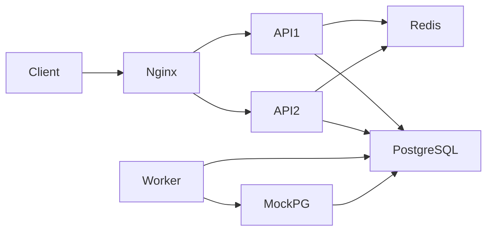

# 설계

Target v1의 역할 분리·입장권과 현재 검증 범위는 [target-v1.md](docs/architecture/target-v1.md)를 따른다.
이 문서의 API1/API2 실행도는 오버레이 없는 baseline 구성이다.

Java 21, Spring Boot 3.5.16, Spring MVC, JPA/Hibernate, HikariCP, Flyway를 사용한다.
Java 21과 Gradle 8.10.2 조합은 [Spring Boot 3.5 지원 범위](https://docs.spring.io/spring-boot/3.5/system-requirements.html)에 맞춘다.
기능별 패키지 안에서 Controller → Service → Repository를 읽는다. DTO는 HTTP 계약이며 호출 계층이 아니다.

## 실행 경계

동일 JAR를 API 2개, Worker, Mock PG에 사용한다. Mock PG의 영속 테이블도 로컬 PostgreSQL에 있다.
이는 프로세스 장애 실험용이며 외부 PG의 물리적 독립성을 재현하지는 않는다.
Nginx는 random two least_conn으로 요청을 분배한다. 순차 구매→결제와 고정 라운드로빈의 정렬을 피하고
활성 연결이 적은 API를 선택하려는 변경이다. 요청 종류별 균등 분포나 DB 락 경합 해소를 보장하지 않는다.
외부 노출은 localhost:8080의 Nginx뿐이며 PostgreSQL·Redis 개발 포트도 localhost에만 바인딩한다.
판매 등록과 테스트 사용자 헤더는 공개 서비스용 인증이 아니다.

기동 순서는 PostgreSQL·Redis → Mock PG readiness → API 2개·Worker readiness → Nginx다.
Spring Boot의 readiness probe와 Compose service_healthy 조건으로 프로세스 시작과 요청 처리 준비를 구분한다.
이 조건은 초기 기동을 조정한다. 실행 도중 PG 장애가 나면 기존 UNKNOWN/재확인 정책을 사용하며,
Compose가 의존 서비스를 자동 중단하거나 비즈니스 기한을 연장하는 것은 아니다.

## 구매 트랜잭션

PurchaseController의 @Valid가 JSON DTO를 검사한다.
PurchaseService가 Redis permit을 얻고 별도 Spring bean인 PurchaseTransactionService를 호출한다.
프록시가 DB 트랜잭션을 시작하고, 정상 반환 전에 커밋한다. 그 뒤 permit을 반환한다.

트랜잭션은 사용자+멱등키의 advisory lock을 얻고 기존 주문을 조회한다.
키가 새것이면 판매 시작, 선택 상품, UUID 오름차순 재고 락, 인당 한도와 수량을 검사한다.
주문·항목·점유·재고 변경을 함께 커밋한다. 실패는 전체 롤백이다.
인당 합산은 재고 락을 얻은 뒤 READ COMMITTED의 새 statement snapshot에서 읽는다.

Redis 활성화 시 전체 API의 구매 permit은 8개, 죽은 프로세스의 permit 유효기간은 10초다.
이는 부하 억제 장치이며 재고 정합성 락이 아니다. 재고 소진 결과는 1초만 캐싱한다.
멱등 결과 보장을 위해 신규 키를 포함한 DB 조회가 여전히 남는다. Redis가 모든 DB 접근을 제거하지 않는다.
캐시 조회/기록이 트랜잭션 안에 남은 비용도 다음 측정 대상이다.
Redis 장애 시 새 구매는 503, 이미 접수된 결제·주문 조회·Worker 처리는 Redis에 의존하지 않는다.
재고 반환은 캐시 TTL 이내에 보인다. 캐시 후처리 실패가 DB 성공을 실패로 뒤집지 않는다.

## 결제와 복구

PaymentService.start는 주문 락 → 소유자 → 멱등키 → 활성 시도/기한 검사 → CREATED 저장을 하나의 트랜잭션으로 수행한다.
Worker는 SKIP LOCKED로 다음 작업의 10초 lease를 획득하고 커밋한다.
기본 4개 실행 슬롯에서 HTTP를 호출한다. 슬롯은 완료 즉시 다음 작업을 가져오며,
250ms 스케줄은 빈 큐를 다시 확인하는 주기일 뿐 4건/250ms 처리 상한이 아니다.
PG 호출에는 DB 트랜잭션이 없다. 동시성은 WORKER_CONCURRENCY로 조정하며 목표 처리율을 의미하지 않는다.
attempt UUID를 PG 멱등키로 사용하므로, PG 성공 뒤 응답 유실/Worker 종료에도 같은 요청을 조회·재실행한다.

결과 반영 순서는 주문 락 → 결제/점유 조회 → 상품 UUID 순 재고 락이다.
성공이면 held→sold, 실패·기한 초과이면 held→available, 미확정이면 보유를 유지하고 1초 뒤 재확인한다.
현재 lease는 획득 시 10초이며 갱신 루프는 없다. Mock PG HTTP timeout은 2초다.
실제 PG의 긴 timeout을 도입할 때는 lease 갱신/소유권과 슬롯 점유를 함께 재설계해야 한다.
만료 작업도 먼저 주문 락을 잡고, 결제 미진행 상태를 다시 확인한다.
점유는 300초, Mock PG 최초 처리 기한은 결제 접수+70초다. UNKNOWN에는 자동 재고 반환 기한을 적용하지 않는다.

새 구매는 저장한 주문/항목/점유에서 응답을 만들어 재고 락 안의 응답 재조회 3개를 제거했다.
멱등 재조회는 기존 DB 조회를 유지한다. `goods.purchase.after_lock`은 락 획득 후 트랜잭션 프록시 반환까지,
`goods.worker.job`은 작업 조회·PG 호출·결과 반영, `goods.worker.pg`는 PG 호출 소요시간을 기록한다.

## 모듈과 향후 변경

sales는 판매/재고 데이터, purchases는 주문/요청 조정, reservations는 점유/반환/확정,
payments는 결제 시도/PG/결과 반영, admission은 Redis 부하 억제, worker는 스케줄링·lease를 소유한다.
JPA entity를 HTTP 응답으로 내보내지 않고 record DTO로 변환한다. open-in-view=false다.

Redis Lua가 실제 점유 원장을 소유하도록 바꾸는 것은 Repository 교체만으로 끝나지 않는다.
reservations의 상태 저장과 purchases/payments의 커밋·보상·재조정 계약을 함께 변경해야 한다.
현재 경계는 영향을 찾기 쉽게 나눈 것이며, 미래 기능을 위한 전략 인터페이스는 만들지 않았다.

새 구현의 결정은 [ADR 0004](docs/decisions/0004-java-baseline.md), 데이터·상태는 docs/architecture를 참고한다.
