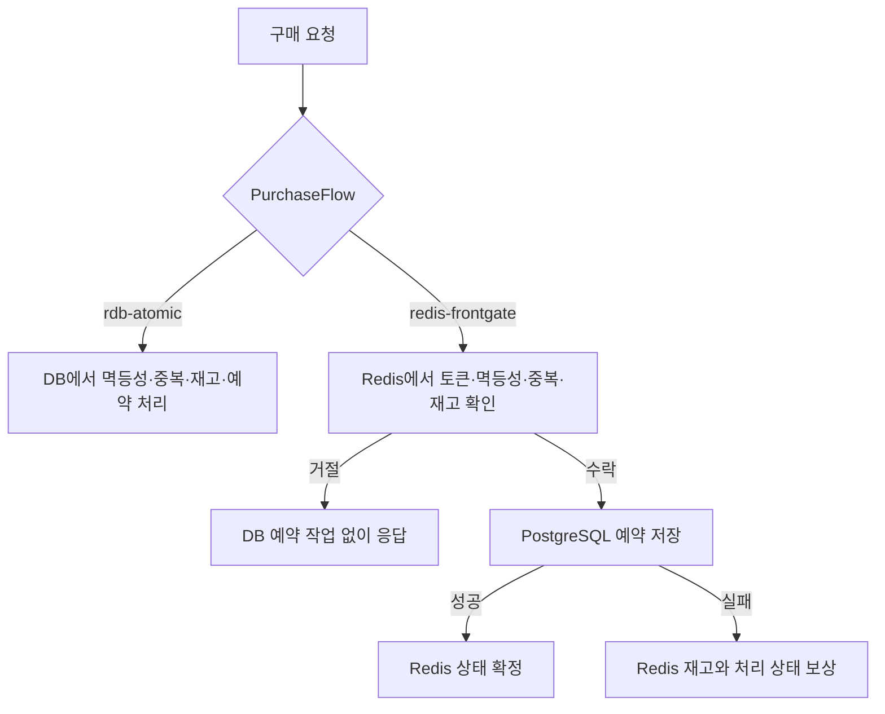

# Limited Goods Reservation

한정 상품 판매처럼 짧은 시간에 요청이 몰리는 상황을 단계별로 구현하고 검증하는 프로젝트입니다.

처음에는 재고 100개에 동시에 1,000개의 구매 요청을 보내는 단순한 실험으로 시작했습니다. 여기서 발생한 오버셀과 재고 불일치를 출발점으로 삼아 재고 처리 방식, 대기열, 예약과 멱등성, Redis와 DB 사이의 일관성 문제를 차례로 다루고 있습니다.

완성된 커머스 서비스를 만드는 것보다는 다음 과정을 직접 확인하는 데 목적이 있습니다.

```text
문제 재현 -> 원인 확인 -> 대안 구현 -> 같은 조건에서 비교 -> 다음 문제 선택
```

현재 `v3.2`까지 진행했으며, 다음 단계에서는 외부 결제 지연을 API 요청 처리와 분리하는 방법을 다룰 예정입니다.

## 진행 과정

| 버전 | 다룬 내용 | 결과 |
| --- | --- | --- |
| v1 | 단순한 RDB 조회-검증-갱신 방식으로 구매 구현 | 오버셀과 lost update 재현 |
| v2 | RDB atomic update, pessimistic lock, Redis Lua 비교 | 세 방식 모두 오버셀을 막았지만 성능과 장애 특성이 달랐음 |
| v3.1 | Redis 대기열과 활성 토큰으로 구매 경로 진입 제어 | 재고 처리 전에 유입량을 제한할 수 있음을 확인 |
| v3.2 | 예약, 멱등성, Redis-DB 보상과 front gate 비교 | Redis를 단순 재고 카운터로 둘 때와 DB 앞단에 둘 때의 차이를 확인 |
| v3.3 | RabbitMQ와 Mock PG를 이용한 결제 지연 격리 | 예정 |

## v1. 오버셀 재현

첫 구매 흐름은 재고를 조회하고, 남은 수량을 확인한 뒤, 판매 수량을 갱신하는 형태였습니다. 동시 요청에 대한 별도 제어는 넣지 않았습니다.

재고 100개에 1,000개의 요청을 보내자 973개 요청이 성공했습니다. 반면 DB의 `sold_quantity`는 97로 끝났습니다.

```text
성공 응답: 973
DB sold_quantity: 97
oversell_count: 873
order_stock_gap: 876
```

재고보다 많은 주문이 만들어진 것뿐 아니라, 여러 트랜잭션이 이전 값을 기준으로 갱신하면서 판매 수량도 주문 수와 맞지 않았습니다. 이후 버전에서는 이 실패를 같은 hot product 조건에서 반복해 비교했습니다.

[v1 실험 기록](records/experiments/v1-oversell-baseline.md)

## v2. 재고 처리 방식 비교

구매 흐름은 그대로 두고 재고를 차감하는 부분만 `StockDeductionStrategy`로 분리했습니다.

비교한 방식은 다음 네 가지입니다.

- `naive-rdb`
- `rdb-atomic`
- `rdb-pessimistic`
- `redis-lua`

100, 500, 1,000명의 사용자를 각 방식마다 5회씩 실행했습니다. 총 60회의 기본 비교에서 naive RDB를 제외한 세 방식은 모두 `oversell_count=0`, `decision_order_gap=0`을 유지했습니다.

이때 Redis Lua가 가장 낮은 HTTP 지연을 보였고, 3,000/5,000/10,000 사용자 확장에서도 응답이 비교적 안정적이어서 다음 버전의 기준 경로로 선택했습니다. 하지만 정상 요청만으로는 Redis와 DB를 함께 사용할 때의 실패를 확인할 수 없었습니다.

재고 차감 직후 DB 저장 실패를 10회 주입한 결과는 달랐습니다.

```text
rdb-atomic: decision_order_gap = 0
redis-lua:  decision_order_gap = -10
```

RDB atomic은 재고 갱신과 주문 저장이 같은 트랜잭션에 있어 함께 롤백됐습니다. Redis Lua는 Redis 차감이 먼저 끝난 뒤 DB 저장이 실패해, 재고 결정은 남았지만 주문은 없는 상태가 생겼습니다. 이 결과 때문에 v3에서는 성능뿐 아니라 Redis와 PostgreSQL 사이의 일관성을 함께 다루게 됐습니다.

- [기본 비교](records/experiments/v2-stock-strategy-comparison.md)
- [고부하 확장 재실행](records/experiments/v2-stock-strategy-expansion-rerun.md)
- [장애 주입](records/experiments/v2-stock-failure-injection.md)
- [v2 구조 결정](records/adr/0001-v2-layered-stock-strategy.md)

## v3.1. 구매 경로 진입 제어

재고 차감 방식만 바꿔도 모든 요청이 애플리케이션과 재고 처리 경로까지 들어오는 것은 달라지지 않습니다. v3.1에서는 Redis ZSET 대기열과 TTL이 있는 활성 토큰을 추가해 구매를 시도할 수 있는 사용자를 먼저 제한했습니다.

1,000명 직접 진입 시에는 1,000명 모두 구매 경로에 도달했습니다. 같은 측정 구간에서 `batchSize=20`, `activeCapacity=100`인 fixed/hybrid 정책은 구매 시도를 200건으로 제한했습니다. 측정된 모든 경우에서 오버셀과 재고 결정-주문 간극은 0이었습니다.

실험하면서 `batchSize`와 `activeCapacity`의 역할도 구분할 수 있었습니다.

- `batchSize`는 일정 시간 동안 새로 입장시키는 속도를 결정했습니다.
- `activeCapacity`는 입장 후 구매하기까지 시간이 길어질 때 동시에 활성 상태인 사용자 수를 제한했습니다.
- 활성 토큰을 바로 소비하는 테스트만으로는 capacity의 효과가 잘 드러나지 않아, 입장 후 대기 시간(think time)을 추가해 다시 비교했습니다.

[v3.1 실험 기록](records/experiments/v3-1-entry-control.md)

## v3.2. 예약 일관성과 Redis의 위치

v3.2에서는 주문 전에 `RESERVED` 상태의 예약을 남기고, 같은 요청을 다시 보내도 예약이 중복 생성되지 않도록 멱등 키를 추가했습니다. 같은 사용자가 다른 멱등 키로 같은 상품을 다시 예약하는 경우도 별도로 막았습니다.

Redis에서 재고를 차감한 뒤 DB 예약 저장이 실패하면 Redis 재고를 복구하고, 이미 소비한 활성 토큰도 되돌리는 동기 보상 흐름을 구현했습니다. 정상 요청, 중복 요청, 장애 주입 스모크 테스트에서는 Redis의 재고 결정 수와 PostgreSQL의 예약 수가 일치했습니다.

하지만 첫 부하 테스트에서는 예상과 다른 결과가 나왔습니다.

```text
redis-lua p95: 2,487.89 ms
rdb-atomic p95: 1,659.16 ms
```

Redis를 사용하더라도 그 전에 DB에서 멱등 키와 기존 예약을 조회하고 있었기 때문에, Redis가 DB 부하를 줄이는 역할을 하지 못했습니다. 재고 차감 구현만 비교하는 것으로는 실제 구매 흐름의 차이를 설명하기 어려웠습니다.

그래서 최종 비교 단위를 `StockDeductionStrategy`가 아닌 `PurchaseFlow`로 바꿨습니다.



최종 실험에서는 대기열 효과가 결과에 섞이지 않도록 대기열을 끄고, Hikari pool 크기를 10으로 고정했습니다. 두 구조를 normal, sold-out, duplicate, failure 시나리오와 1,000/3,000/5,000 VU 조합으로 비교했습니다.

24개 실행 모두 다음 조건을 만족했습니다.

```text
http_req_failed_rate = 0
unexpected_responses = 0
oversell_count = 0
decision_reservation_gap = 0
```

이 조건에서 Redis front gate의 p95는 RDB atomic보다 약 43.5~69.5% 낮았습니다. 특히 품절이나 중복 요청처럼 DB 예약 작업 전에 거절할 수 있는 요청이 많을 때 차이가 컸습니다.

그렇다고 Redis front gate가 항상 더 나은 선택이라는 결론은 내리지 않았습니다. RDB atomic은 구조가 단순하고 PostgreSQL 안에서 일관성을 유지하기 쉽습니다. Redis front gate는 DB로 들어오는 요청을 줄일 수 있지만 처리 중 마커, TTL, 확정과 보상 흐름이 추가됩니다. 대기열이 유입을 충분히 제한하는 환경이라면 RDB atomic도 여전히 선택할 수 있습니다.

- [첫 예약 부하 테스트](records/experiments/v3-2-reservation-load-baseline.md)
- [최종 구조 비교](records/experiments/v3-2-architecture-load-comparison.md)
- [비교 과정 정리](docs/experiments/v3-2-frontgate-comparison-summary.md)
- [Redis front gate 결정](records/adr/0002-v3-2-minimal-redis-front-gate.md)

## 진행하면서 배운 점

- 동시성 제어 방식은 정합성뿐 아니라 실패가 발생했을 때 어느 상태가 남는지도 함께 확인해야 했습니다.
- Redis를 사용한다는 사실보다 Redis를 요청 흐름의 어디에 두는지가 더 중요했습니다.
- 대기열의 진입 제어와 재고·예약의 일관성은 서로 다른 문제였고, 실험에서도 변수를 분리할 필요가 있었습니다.
- 부하 테스트 수치는 환경과 시나리오에 따라 달라졌습니다. 비교 조건을 고정하고 원본 결과와 한계를 같이 남기는 것이 수치 자체보다 중요했습니다.
- 정상 경로만 테스트했을 때 보이지 않던 문제가 장애 주입과 중복 요청에서 드러났습니다.

## 문서 구조

README에는 프로젝트의 전체 흐름만 정리하고, 구현 기준과 실험 결과는 별도 문서에 남겼습니다. 다음 버전의 계획이 이전 실험의 결론처럼 섞이지 않도록 계획, 결정, 측정 결과의 위치를 구분했습니다.

- `docs/`: 버전 범위, 도메인, 구조, 검증 방법
- `records/adr/`: 구조를 선택한 이유와 검토한 대안
- `records/experiments/`: 실험 조건, 측정 결과, 해석과 한계
- `RUNBOOK.md`: 로컬 실행과 실험 재현 방법

## 현재 범위

지금까지의 실험은 로컬 Docker Compose 환경과 하나의 hot product를 기준으로 진행했습니다. 서로 다른 구조를 같은 조건에서 비교하는 데 초점을 맞췄으며, 측정값을 실제 운영 환경의 처리 용량으로 해석하지는 않았습니다. 특히 v3.2 최종 비교는 시나리오와 부하 조합마다 한 번씩 실행했기 때문에 반복 측정을 통한 신뢰 구간은 아직 구하지 않았습니다.

Redis front gate가 요청을 수락한 뒤 DB 저장 과정에서 발생한 오류는 동기 보상으로 처리했습니다. 다만 Redis 수락 직후 애플리케이션 프로세스가 종료되는 경우는 아직 다루지 못했습니다. 이 문제까지 해결하려면 처리 중 상태의 정리와 Redis-DB 간 reconciliation 같은 별도 복구 과정이 필요합니다.

인증, 장바구니, 배송 같은 일반적인 커머스 기능은 추가하지 않았습니다. 현재는 동시 요청, 진입 제어, 재고와 예약의 일관성을 확인하는 데 필요한 범위만 구현했습니다.

## 실행과 코드

사용 기술은 Java 17, Spring Boot 3.3.5, PostgreSQL 16, Redis 7, k6, Prometheus, Grafana입니다.

- [로컬 실행과 실험 재현](RUNBOOK.md)
- [구매 흐름](src/main/java/com/limitedgoodsreservation/purchase/service)
- [Redis front gate](src/main/java/com/limitedgoodsreservation/reservation/gate/RedisReservationFrontGate.java)
- [Redis 대기열](src/main/java/com/limitedgoodsreservation/waitingroom/service/RedisWaitingRoomStore.java)
- [전체 로드맵](docs/01-roadmap.md)
- [아키텍처 변화](docs/03-architecture.md)
- [검증 및 실험 규칙](docs/04-verification-experiments.md)

다음 버전인 v3.3에서는 RabbitMQ와 Mock PG를 이용해 외부 결제 지연을 API 요청 스레드에서 분리하는 방법을 검증할 예정입니다.
