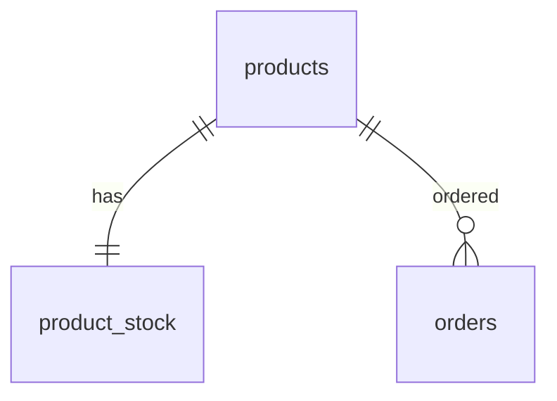
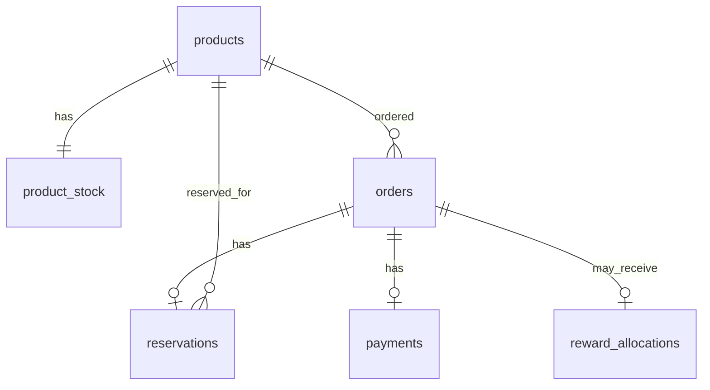

# 02. Domain Data

This document is the Truth for domain terms, identifiers, ERD, table growth, Redis keys, and status candidates.

Version intent belongs to `docs/01-roadmap.md`. Package structure belongs to `docs/03-architecture.md`.

---

## 1. Domain Scope

The project models limited goods sale with product-level stock.

Early-version simplifications:

```text
product-level stock only
single hot product for core experiments
one user buys one unit in core scenarios
no SKU
no size/color option
no cart
no shipping
no coupon
no real authentication / JWT
```

---

## 2. Identity and Stock Defaults

### Test User Identity

Use request header:

```text
X-USER-ID: {userId}
```

Rules:

```text
v1 does not create a users table
orders.user_id stores the test user id as a scalar value
real authentication is future scope
```

### Product / Stock Identity

External flows use:

```text
productId
```

Rules:

```text
productId is used by APIs, k6, Redis keys, waiting room, and reservation flows
product_stock.id is an internal database surrogate key
core v1/v2 experiments use productId = 1 as the hot product
```

Do not expose `stockId` as the core experiment identifier.

---

## 3. v1 Data Model

v1 keeps only the data needed to reproduce the naive purchase failure.

Tables:

```text
products
product_stock
orders
```

No `users` table in v1.

Suggested v1 fields:

```text
products:
- id
- name
- price
- created_at
- updated_at

product_stock:
- id
- product_id
- initial_quantity
- sold_quantity
- created_at
- updated_at

orders:
- id
- user_id
- product_id
- status
- created_at
- updated_at
```

v1 order status:

```text
CREATED: successful naive purchase order, without payment semantics
```

v1 ERD:



v1 seed / load-test default:

```text
productId = 1
initial_quantity = 100
concurrent users = about 1000
each request uses a distinct X-USER-ID
```

---

## 4. Target Domain Flow

v1 intentionally does not implement the full target flow.

Target limited goods flow:

```text
waiting queue
-> active token
-> reservation
-> payment
-> sold or released
```

Domain distinction:

```text
Active token: temporary right to attempt reservation; not a purchase guarantee.
Reservation: temporary stock hold created after selected stock strategy succeeds.
Payment: confirms or releases the reservation.
Reward: limited benefit allocated after payment success; separate from product stock.
```

---

## 5. Version-Based Data Growth

### v2

Add only when the selected stock strategy needs them:

```text
reservations
Redis stock keys
reservation TTL keys
idempotency keys if idempotency becomes part of the version objective
```

### v3.1

```text
waiting queue Redis keys
active token Redis keys
```

### v3.2

```text
payments
payment retry count
payment result timestamps
payment job state if needed
```

### v4

```text
reward_allocations
```

### v5+

```text
users
sale_events
sku_stock
webhook_events
reconciliation tables
```

---

## 6. Target ERD

This is the target shape. Earlier versions implement only the tables their version objective needs.



`users` is intentionally absent from the early target ERD. Real users/authentication are v5+ scope unless the roadmap changes.

---

## 7. Redis Key Namespace

Keep Redis keys productId-based until the domain expands.

```text
stock:available:{productId}
reservation:{reservationId}
user:reservation:{productId}:{userId}
idempotency:{key}
waiting:queue:{productId}
active-token:{productId}:{userId}
```

Key ownership:

```text
stock:available:{productId}          v2 Redis stock strategy
reservation:{reservationId}          reservation TTL marker
user:reservation:{productId}:{userId} one active reservation rule
idempotency:{key}                    duplicated request result
waiting:queue:{productId}            v3.1 waiting room
active-token:{productId}:{userId}    v3.1 active token
```

---

## 8. Status Candidates

Add statuses only when the version introduces the related concept.

```text
OrderStatus:
- PENDING_PAYMENT
- PAID
- FAILED
- CANCELED

ReservationStatus:
- RESERVED
- CONFIRMED
- EXPIRED
- RELEASED

PaymentStatus:
- READY
- PROCESSING
- SUCCESS
- FAILED
- UNKNOWN

RewardStatus:
- GRANTED
- NOT_GRANTED
```

Payment timeout rule:

```text
PG timeout is not confirmed failure.
Timeout should become UNKNOWN or retry target.
```
