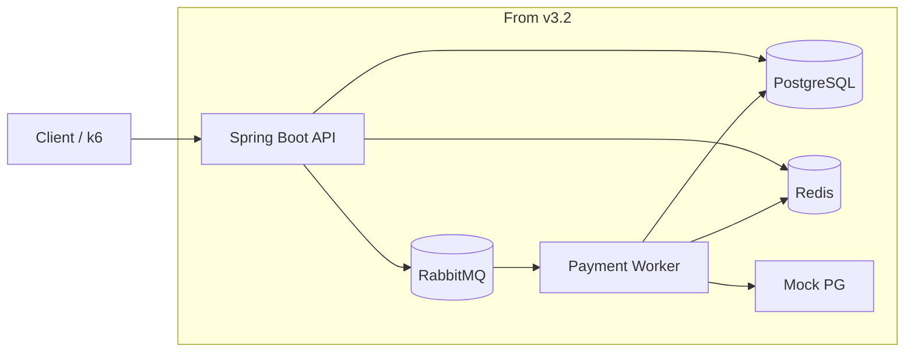

# 03. Architecture

This document defines the target architecture and package rules.

---

## 1. Architecture Style

Use a lightweight Hexagonal Architecture.

The goal is not strict DDD. The goal is:

```text
testable business logic
clear dependency direction
clear separation between domain and infrastructure
portfolio-friendly explanation
```

Core rule:

```text
domain does not know JPA, Redis, RabbitMQ, HTTP, or Spring Web DTOs
```

---

## 2. Base Package Structure

```text
src/main/java/com/limitedgoodsreservation/
  LimitedGoodsReservationApplication.java
  domain/
  application/
  adapter/
    in/
      web/
    out/
      persistence/
      redis/
      mq/
      pg/
  global/
```

The base package may be renamed later if a personal domain or GitHub-based package naming rule is selected.

---

## 3. Package Responsibilities

### domain

Contains pure business concepts and rules.

Examples:

```text
Order
Reservation
Payment
RewardAllocation
StockPolicy
ReservationStatus
OrderStatus
PaymentStatus
```

Rules:

```text
no JPA annotations if avoidable in core domain
no Redis access
no RabbitMQ access
no Controller DTOs
no HTTP concepts
```

---

### application

Contains use cases, transaction boundaries, and ports.

Examples:

```text
PurchaseNaiveUseCase
ReserveProductUseCase
ReleaseExpiredReservationUseCase
IssueActiveTokenUseCase
RequestPaymentUseCase
ProcessPaymentResultUseCase
AllocateRewardUseCase
```

Application layer may define ports such as:

```text
ProductStockPort
OrderPort
ReservationPort
StockReservationPort
WaitingQueuePort
ActiveTokenPort
PaymentJobPort
PaymentGatewayPort
```

---

### adapter.in.web

Contains web adapters.

Examples:

```text
OrderController
ReservationController
WaitingRoomController
PaymentController
RewardController
Request DTOs
Response DTOs
```

Rules:

```text
Controller should call application use cases.
Controller should not contain business rules.
```

---

### adapter.out.persistence

Contains PostgreSQL/JPA related code.

Examples:

```text
JpaOrderEntity
JpaReservationEntity
JpaPaymentEntity
SpringDataOrderRepository
OrderPersistenceAdapter
```

Rules:

```text
JPA entities should not leak into domain use cases if separated.
Persistence adapter maps between JPA model and domain/application model.
```

---

### adapter.out.redis

Contains Redis related code.

Examples:

```text
RedisStockReservationAdapter
RedisWaitingQueueAdapter
RedisActiveTokenAdapter
RedisIdempotencyAdapter
Lua scripts
```

Responsibilities:

```text
stock reservation
reservation TTL
waiting queue
active token
short-term idempotency
```

---

### adapter.out.mq

Contains RabbitMQ related code.

Examples:

```text
RabbitPaymentJobPublisher
PaymentJobConsumer
PaymentRequestedMessage
```

Responsibilities:

```text
publish payment job
consume payment job
retry payment job when allowed
```

---

### adapter.out.pg

Contains Mock PG integration.

Examples:

```text
MockPgClient
MockPgScenario
MockPgPaymentResult
```

MVP scenarios:

```text
success
fail
delay
timeout
```

---

### global

Contains cross-cutting infrastructure.

Examples:

```text
config
exception
common response
logging
metrics
```

---

## 4. Dependency Direction

Preferred direction:

```text
adapter.in.web
→ application
→ domain

adapter.out.*
→ application ports
```

The application layer owns the use case. Infrastructure implements ports.

---

## 5. Runtime Components by Version

Runtime components should be reproducible through Docker Compose in local experiment environments.

Local Java execution is allowed as a developer convenience, but version-level verification should use the Docker Compose topology so that API instances, infrastructure services, load testing, and later scale-out experiments run in the same explicit environment.

### v1

```text
Spring API container
PostgreSQL
k6 container
```

### v2.2

```text
Spring API container
PostgreSQL
Redis
Redis Lua
k6 container
```

### v2.4

```text
Nginx
Spring API container instance 1
Spring API container instance 2
PostgreSQL
Redis
k6 container
```

### v3.1

```text
Spring API container
PostgreSQL
Redis
Admission Scheduler
Waiting Queue
Active Token
k6 container
```

### v3.2

```text
Spring API container
PostgreSQL
Redis
RabbitMQ
Payment Worker
Mock PG
k6 container
```

---

## 6. Redis / RDB / MQ Responsibility Split

### Redis

```text
real-time high-concurrency control
stock reservation decision
reservation TTL
waiting queue
active token
short-term idempotency
```

### PostgreSQL

```text
durable business records
orders
reservations
payments
reward allocations
auditability
```

### RabbitMQ

```text
asynchronous payment job delivery
payment delay isolation
worker-based retry
```

---

## 7. Transaction Boundary Notes

General rule:

```text
RDB transaction protects durable state changes.
Redis Lua protects real-time reservation atomicity.
RabbitMQ separates payment work from request thread.
```

v2.2 partial failure rule:

```text
If Redis reservation succeeds but RDB save fails,
try best-effort Redis reservation release.
Full reconciliation is future scope.
```

---

## 8. Architecture Diagram


