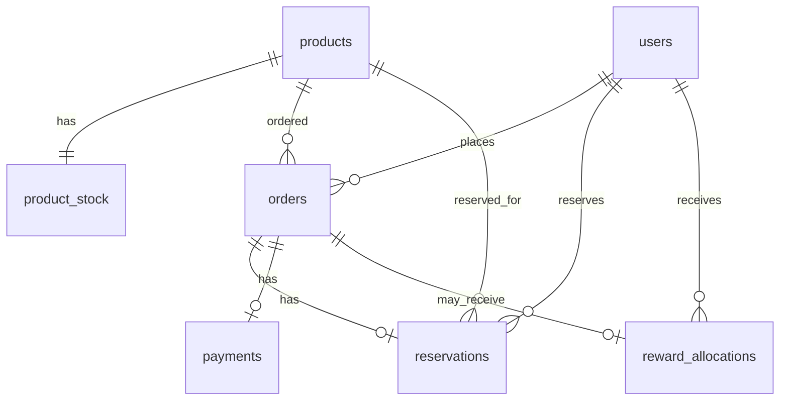

# 04. Data Model

This document defines the initial RDB tables, Redis key namespace, and version-based data model growth.

---

## 1. Data Responsibility Principle

```text
Redis handles real-time control.
PostgreSQL handles durable business records.
```

Redis is not the only durable source of business truth.

---

## 2. Version-Based Table Scope

### v1

```text
users
products
product_stock
orders
```

### v2.2

```text
reservations
```

### v3.2

```text
payments
```

### v4

```text
reward_allocations
```

### v5+

```text
webhook_events
sale_events
sku_stock
```

---

## 3. Target RDB Tables

### users

Purpose:

```text
minimal test user identity
```

Suggested fields:

```text
id
name
created_at
```

Authentication is intentionally simplified. API requests may use:

```text
X-USER-ID
```

---

### products

Purpose:

```text
product master data
```

Suggested fields:

```text
id
name
price
sale_status
created_at
updated_at
```

---

### product_stock

Purpose:

```text
durable stock baseline and sold count
```

Suggested fields:

```text
id
product_id
initial_quantity
sold_quantity
created_at
updated_at
```

Notes:

```text
Redis controls real-time reservation availability.
RDB records durable stock baseline and confirmed sold count.
```

---

### orders

Purpose:

```text
order record
```

Suggested fields:

```text
id
user_id
product_id
status
created_at
updated_at
```

Suggested status:

```text
PENDING_PAYMENT
PAID
FAILED
CANCELED
```

---

### reservations

Purpose:

```text
temporary stock hold record
```

Suggested fields:

```text
id
user_id
product_id
order_id
status
expires_at
created_at
updated_at
```

Suggested status:

```text
RESERVED
CONFIRMED
EXPIRED
CANCELED
RELEASED
```

---

### payments

Purpose:

```text
payment processing record
```

Suggested fields:

```text
id
order_id
reservation_id
status
pg_scenario
retry_count
approved_at
created_at
updated_at
```

Suggested status:

```text
READY
PROCESSING
SUCCESS
FAILED
TIMEOUT
UNKNOWN
```

---

### reward_allocations

Purpose:

```text
limited reward allocation record
```

Suggested fields:

```text
id
user_id
order_id
product_id
status
policy
allocated_at
created_at
```

Suggested status:

```text
GRANTED
NOT_GRANTED
```

---

## 4. Target ERD



---

## 5. Redis Key Namespace Draft

Redis key namespace should stay productId-based until v3.2.

```text
stock:available:{productId}
reservation:{reservationId}
user:reservation:{productId}:{userId}
idempotency:{key}
waiting:queue:{productId}
active-token:{productId}:{userId}
```

---

## 6. Redis Key Responsibilities

### stock:available:{productId}

Purpose:

```text
available stock counter used by Lua reservation
```

Introduced:

```text
v2.2
```

---

### reservation:{reservationId}

Purpose:

```text
reservation TTL marker
```

Introduced:

```text
v2.2
```

---

### user:reservation:{productId}:{userId}

Purpose:

```text
prevent multiple active reservations for the same user-product pair
```

Introduced:

```text
v2.3
```

---

### idempotency:{key}

Purpose:

```text
return previous response for duplicated request with same idempotency key
```

Introduced:

```text
v2.3
```

---

### waiting:queue:{productId}

Purpose:

```text
product-level waiting queue
```

Introduced:

```text
v3.1
```

---

### active-token:{productId}:{userId}

Purpose:

```text
TTL-based right to attempt reservation
```

Introduced:

```text
v3.1
```

---

## 7. Reservation TTL

Default:

```text
3 minutes
```

Test override:

```text
5-10 seconds
```

---

## 8. Out of Scope Until v5+

```text
SKU-level stock
size/color option
saleEvent table
webhook_events implementation
duplicate webhook handling
reconciliation table
```
