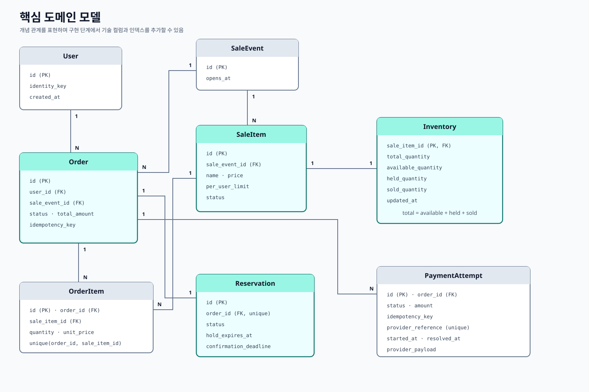

# 도메인 모델

## 목적

이 모델은 재고와 결제 정합성을 보호하기 위해 필요한 최소한의 영속 관계를 표현합니다. 개념 ERD이므로 컬럼 타입, 인덱스, 마이그레이션 세부사항은 구현 단계에서 정합니다.



## Aggregate 형태

- 하나의 `SaleEvent`에는 여러 `SaleItem`이 있고, 각 `SaleItem`에는 하나의 `Inventory`와 상품별 인당 제한이 있다.
- `Order`는 한 구매자와 판매 이벤트에 속하며 하나 이상의 `OrderItem`을 가진다.
- `Order`에는 모든 주문 항목을 포괄하는 하나의 `Reservation`이 있다. 따라서 여러 상품이 하나의 만료 시각과 전체 성공·실패 결과를 공유한다.
- 결제 재시도와 결제사 응답 이력을 남기기 위해 한 `Order`에는 여러 `PaymentAttempt`가 존재할 수 있다.

## 재고 전이

각 판매 상품에서 다음 식이 항상 성립해야 합니다.

```text
total_quantity = available_quantity + held_quantity + sold_quantity
```

- 점유: `available -= quantity`, `held += quantity`
- 구매 확정: `held -= quantity`, `sold += quantity`
- 만료 또는 실패 확정: `held -= quantity`, `available += quantity`

여러 상품의 상태 전이는 하나의 PostgreSQL 트랜잭션에서 처리합니다. 판매 가능 재고와 인당 제한 검증도 같은 트랜잭션에 포함합니다.

## DB가 보호할 제약

- 모든 재고 수량은 음수가 아니며 합계는 등록한 총수량과 같다.
- 주문 항목의 `(order_id, sale_item_id)`는 유일하다.
- 한 주문에는 점유가 최대 하나만 존재한다.
- 구매 멱등키는 해당 요청 범위에서 유일하다.
- 결제사의 결제 참조값은 유일하다.
- 한 주문에는 성공한 결제 시도가 최대 하나만 존재한다.
- 한 주문에는 활성 상태이거나 결과 미확정인 결제 시도가 최대 하나만 존재한다.

마지막 두 제약은 PostgreSQL partial unique index 또는 동일한 수준의 트랜잭션 검사로 구현할 수 있습니다. 구체적인 SQL은 구현 세부사항이며 불변식이 계약입니다.

## 소유권 메모

`Order`는 구매자가 무엇을 사려는지 기록합니다. `Reservation`은 재고에 대한 임시 권리를 기록합니다. `PaymentAttempt`는 결제 경계와의 각 상호작용을 기록합니다. 이 개념을 분리하면 실패한 재시도나 중복 콜백이 주문의 이전 이력을 덮어쓰지 않습니다.

인증은 `Order`가 참조하는 안정적인 `user_id` 외에는 아직 모델링하지 않습니다. 재고 이동 이력이나 outbox는 구현 또는 복구 실험에서 현재 기록만으로 부족하다는 근거가 생길 때 추가합니다.
