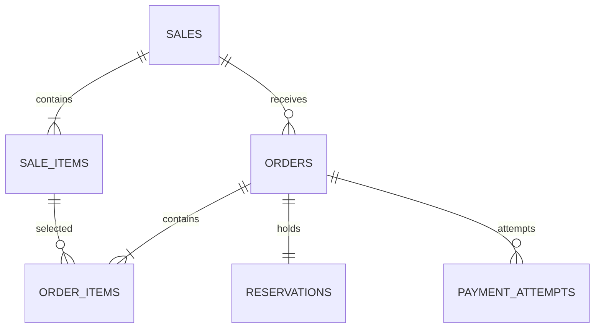

# 데이터 관계

sale_items는 현재 재고 수량과 가격/인당 제한을 함께 가진다.
order_items는 주문 당시 단가와 수량을 고정한다. reservations는 주문 전체의 점유 기한을 가진다.
payment_attempts는 재시도마다 별도 UUID와 상태/lease를 가진다.

DB CHECK로 음수 재고와 total 합계를 검사한다.
UNIQUE(user_id,idempotency_key)로 구매 멱등성, UNIQUE(order_id,idempotency_key)로 결제 멱등성을 보강한다.
부분 unique index는 CREATED/PROCESSING/UNKNOWN/SUCCEEDED 중 하나만 주문에 존재하도록 한다.
행 간 합계는 DB CHECK만으로 보장할 수 없으므로 트랜잭션과 ops/invariants.sql로 검증한다.
