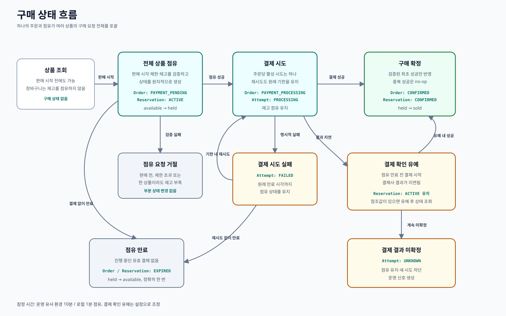

# 구매 흐름

## 목적

이 문서는 구매자의 행동과 `Inventory`, `Reservation`, `Order`, `PaymentAttempt`가 소유한 상태를 연결합니다.

이 문서의 그림은 **상태와 분기**를 설명합니다. API, Worker, PostgreSQL, Mock PG 사이의 대표 호출 순서는 [시스템 개요](system-overview.md#대표-사용자-흐름)에서 확인합니다.

## 상태 소유권

| 개념 | 초기 상태 | 의미 |
|---|---|---|
| `Order` | `PAYMENT_PENDING`, `PAYMENT_PROCESSING`, `CONFIRMED`, `EXPIRED` | 전체 구매 결과 |
| `Reservation` | `ACTIVE`, `CONFIRMED`, `EXPIRED` | 재고에 대한 임시 권리 |
| `PaymentAttempt` | `CREATED`, `PROCESSING`, `SUCCEEDED`, `FAILED`, `UNKNOWN` | 한 번의 결제사 상호작용 |

`Reservation`은 결제 진행 상태를 중복해서 표현하지 않습니다. 유효한 결제가 진행되는 동안에도 `ACTIVE`로 유지되며, 결제 진행 여부는 `Order`와 `PaymentAttempt`가 표현합니다.

## 정상 경로

1. 구매자가 상품 수량과 구매 멱등키를 보낸다.
2. 하나의 트랜잭션에서 판매 시작 시각·인당 제한·모든 재고를 검사하고, 주문과 점유를 생성하며, 요청 수량을 `available`에서 `held`로 이동한다.
3. 구매자가 결제 시도를 시작한다. 재시도는 새 주문이 아니라 동일 주문 아래의 새 `PaymentAttempt`를 생성한다.
4. 검증된 성공 알림을 받으면 관련 주문을 잠근다. 이미 반영된 결과라면 no-op으로 처리하고, 최초 결과라면 결제 시도·주문·점유를 확정하며 `held`를 `sold`로 이동한다.

## 실패와 시간 경로

### 점유 요청 실패

한 상품이라도 재고가 부족하거나 사용자의 남은 구매 한도를 넘으면 주문과 부분 점유를 모두 생성하지 않습니다.

### 결제를 시작하지 않음

`hold_expires_at`에 Worker가 주문과 점유를 만료시키고 모든 수량을 `available`로 돌려놓습니다. 같은 만료 작업을 반복해도 추가 변화가 없어야 합니다.

### 결제 명시적 실패

해당 `PaymentAttempt`는 `FAILED`가 됩니다. 구매자는 원래 점유 시간 안에서 다시 시도할 수 있으며, 재시도는 `hold_expires_at`을 연장하지 않습니다.

### 기한 전 시작한 결제 결과가 늦게 도착함

점유 만료 전 시작한 결제에는 짧은 확인 유예를 제공합니다. 유예 중에는 점유를 유지하여 같은 재고가 다른 구매자에게 판매되지 않도록 합니다. 유예 안에 성공하면 구매를 확정합니다.

유예 후에도 결과를 받지 못하고 결제사 참조값이 있으면 Mock PG에 결제사 측 상태를 조회합니다. 실패가 확인되면 주문과 점유를 만료시키고 재고를 반환합니다. 여전히 알 수 없거나 결제사 참조값 자체를 얻지 못했다면 `PaymentAttempt`를 `UNKNOWN`으로 표시하고 재고를 계속 점유하며, 새 결제 시도를 막고, 운영 신호를 남깁니다. 실제 결제사에서 영구적으로 알 수 없는 결과를 자동 해결하는 기능은 초기 범위에 포함하지 않습니다.

### 중복 결과 도착

결제사 참조값의 유일성과 현재 상태 검사를 이용해 반복된 성공 알림을 성공적인 no-op으로 처리합니다. 콜백 멱등성은 구매 요청의 멱등키와 별개의 경계입니다.

## 시간 기본값

[PROJECT.md](../../PROJECT.md)의 시간 값은 잠정 설정입니다. 테스트에서는 실제로 기다리지 않고 주입 가능한 clock을 사용합니다.

## 초기 검증 시나리오

- 두 구매자가 동시에 마지막 재고를 중복 점유하지 못한다.
- 한 사용자의 동시 요청이 상품별 인당 제한을 넘지 못한다.
- 한 상품의 재고 부족이 요청한 모든 상품의 상태를 그대로 유지한다.
- 여러 상품의 점유가 만료되면 모든 재고가 정확히 한 번 반환된다.
- 결제 재시도는 동일 주문과 원래 기한을 유지한다.
- 확인 유예 안의 지연 성공은 주문을 확정한다.
- 중복 성공은 재고를 두 번 변경하지 않는다.
- 결과 미확정은 새 시도를 막고 로그와 메트릭에서 관찰할 수 있다.
