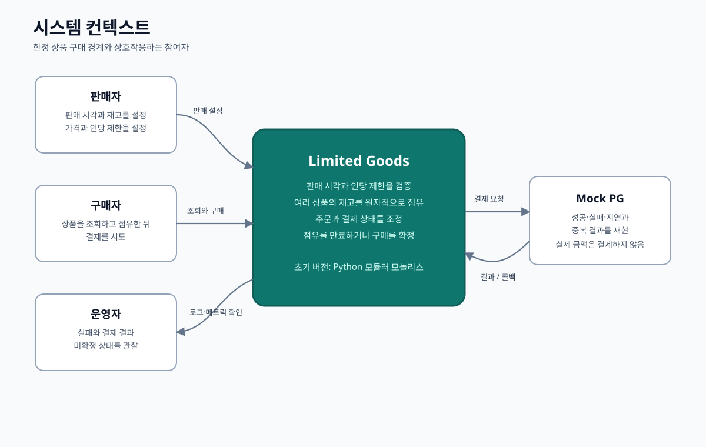
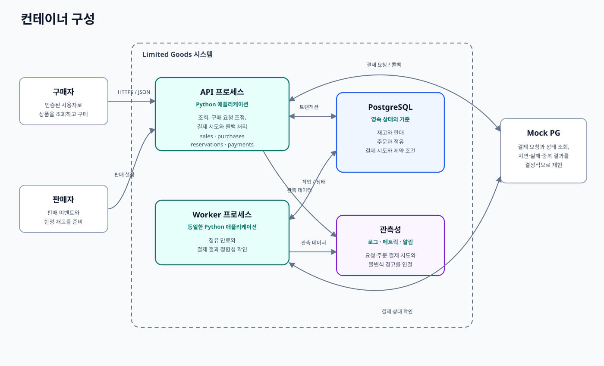

# 시스템 개요

## 목적

이 문서는 Limited Goods의 시스템 경계와 초기 구매 계약을 실행하는 각 런타임의 책임을 보여줍니다. 내부 클래스나 프레임워크별 계층 구조는 규정하지 않습니다.

## 시스템 컨텍스트

판매자는 유한한 재고를 가진 판매를 준비하고, 구매자는 Limited Goods를 통해 조회와 구매를 수행합니다. 초기에는 Mock PG를 사용하지만 결제 결과는 외부 경계를 넘어 지연되거나 중복될 수 있다고 가정합니다.

## 컨테이너 구성

API와 Worker는 동일한 Python 애플리케이션과 모듈 경계를 사용합니다. 별도 서비스여서가 아니라 요청 처리와 시간 기반 복구 작업의 생명주기가 다르기 때문에 별도 프로세스로 실행합니다.

PostgreSQL이 모든 구매 상태를 영속적으로 소유합니다. Mock PG는 교체 가능한 결제사 경계를 통해 접근하며 주문이나 재고를 직접 변경할 수 없습니다.

## 책임 경계

| 경계 | 소유하는 책임 | 소유하지 않는 책임 |
|---|---|---|
| API | 요청 검증, 유스케이스 조정, 콜백 | 독립적인 재고 원본 |
| Worker | 만료와 결제 정합성 확인 작업의 실행 | 별도의 비즈니스 규칙 |
| PostgreSQL | 영속 상태, 제약 조건, 트랜잭션 결과 | 외부 결제 결과 |
| Mock PG | 모의 결제 결과와 알림 | 주문 확정 |
| 관측성 | 로그, 메트릭, 알림 | 복구 결정 |

## 로컬 배포 형태

초기 로컬 환경은 API, Worker, PostgreSQL, Mock PG를 컨테이너로 실행합니다. 가능한 테스트와 부하 생성은 공개된 경계를 통해 수행합니다. 이를 통해 초기부터 오케스트레이션 복잡성을 추가하지 않으면서 단일 호스트 또는 소규모 클라우드 배포와 유사한 실행 형태를 연습합니다.

## 재검토 조건

- 독립적인 확장, 장애 격리, 보안 경계, 소유권, 배포 주기가 필요한 경우에만 모듈이나 서비스를 분리한다.
- 재현 가능한 부하에서 PostgreSQL이나 동기식 조정이 병목임을 확인한 뒤 캐시, 큐, 재고 게이트를 추가한다.
- Worker의 소유권이나 가용성 요구가 애플리케이션과 달라질 때 전용 정합성 확인 서비스를 검토한다.
