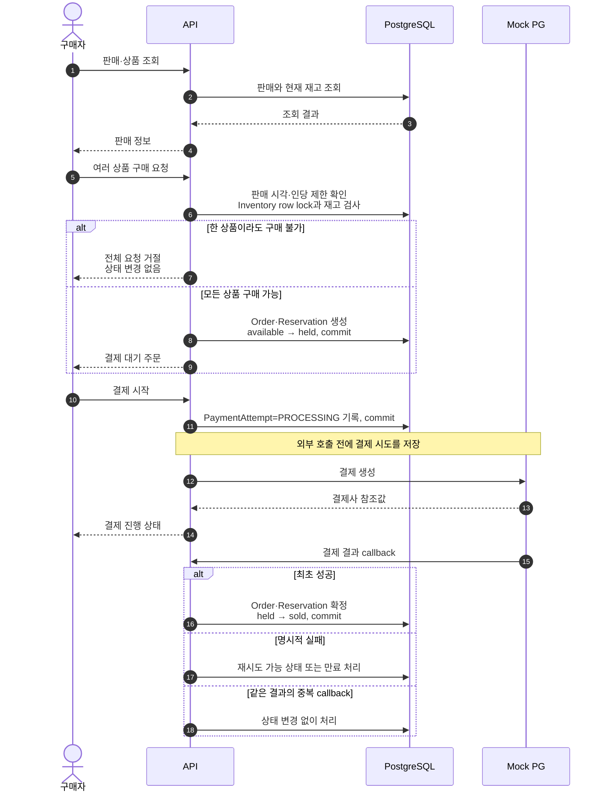
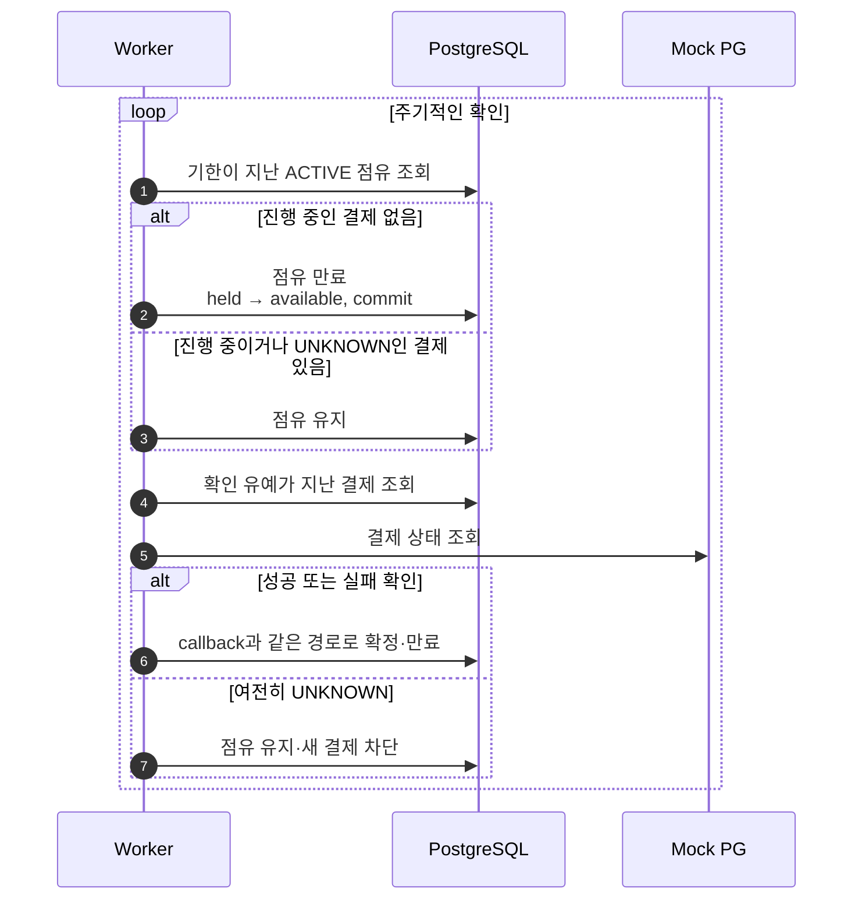

# 시스템 개요

## 목적

이 문서는 현재 Local Baseline을 **실행 구성**과 **대표 사용자 흐름** 두 관점으로 요약합니다. 상태 전이와 개념 관계가 더 필요하면 [구매 흐름](purchase-flow.md)과 [도메인 모델](domain-model.md)을 이어서 봅니다.

## 아키텍처 구성

판매자는 한정 판매를 준비하고 구매자는 상품을 조회하고 구매합니다. 결제사는 초기 버전에서 Mock PG로 대체하며, 운영자는 로그와 메트릭으로 실패와 결과 미확정 상태를 확인합니다.

### 로컬 실행 구성

[편집 가능한 Draw.io 원본](../diagrams/container-view.drawio)

| 구성 요소 | 역할 |
|---|---|
| API | 조회, 구매, 결제 시작과 Mock PG callback 처리 |
| Worker | 만료된 점유 반환과 결제 결과 재확인 |
| PostgreSQL | 재고·주문·점유·결제 상태의 영속적인 기준 |
| Mock PG | 성공·실패·지연·중복·미확정 결제 재현 |
| Prometheus | API의 `/metrics` 수집 |

API와 Worker는 같은 Python 코드베이스를 서로 다른 프로세스로 실행합니다. PostgreSQL만 영속 상태를 소유하고 Mock PG의 상태는 프로세스 메모리에 있습니다. Alembic migration은 API가 시작되기 전에 별도 job으로 실행됩니다.

## 대표 사용자 흐름

### 구매와 결제

구매 요청과 결제 요청은 각각 멱등키로 중복을 식별합니다. 여러 상품의 점유는 한 트랜잭션에서 모두 성공하거나 모두 실패하며, 결제 실패 후 재시도해도 원래 점유 기한은 연장되지 않습니다.

### 만료와 결과 미확정

결제 결과를 확정할 수 없으면 재고를 자동 반환하지 않는 것이 현재 정책입니다. 결제사 참조값이 있으면 Worker가 계속 조회하고, 참조값도 얻지 못한 경우에는 자동 확인할 수 없으므로 `UNKNOWN` 상태와 운영 로그를 남깁니다.

## 설명할 때 기억할 핵심

- PostgreSQL이 재고와 구매 상태의 최종 기준이다.
- 구매 요청은 여러 상품을 한 번에 점유하며 부분 성공하지 않는다.
- 외부 PG 호출 전에 결제 시도를 저장하여 미확정 결과를 추적한다.
- API는 요청을 처리하고 Worker는 시간에 따른 만료와 복구를 담당한다.

## 현재 범위와 갱신 기준

현재 구성에는 실제 인증·PG, Redis, 메시지 큐, Load Balancer와 다중 instance가 없습니다. 이 요소들은 측정이나 운영 요구가 생긴 뒤 검토합니다.

실행 단위나 통신 방향이 달라지면 아키텍처 그림을, 사용자에게 보이는 처리 순서나 실패 동작이 달라지면 시퀀스 그림을 갱신합니다. 중요한 선택의 이유는 [ADR](../decisions/README.md)에 남기고 단순한 함수명이나 DB 컬럼 변경은 이 문서에 반영하지 않습니다.
