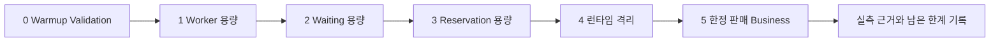
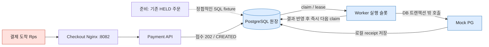
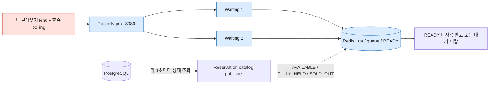
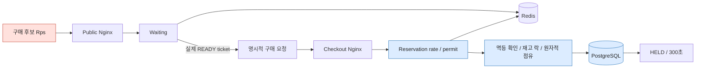
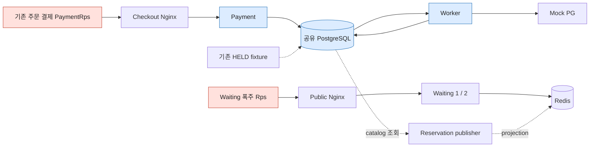
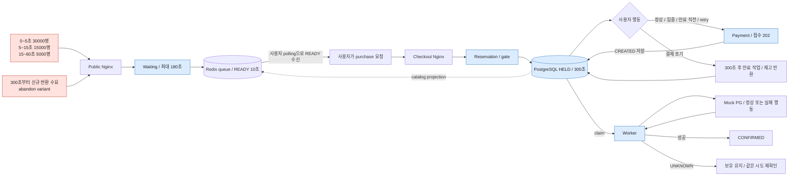
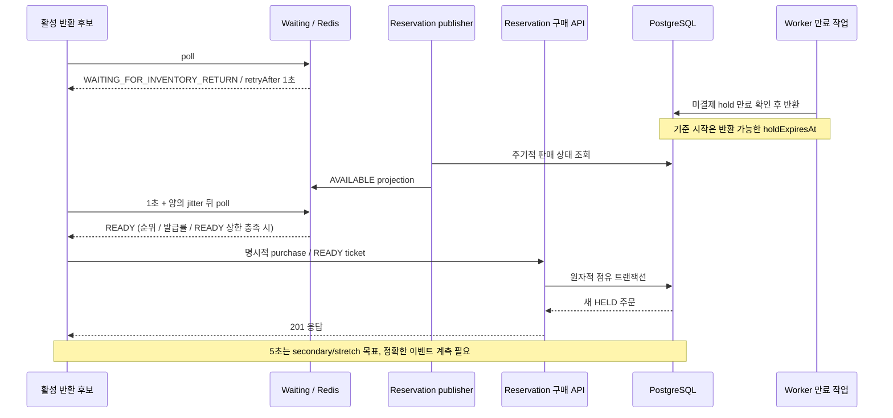

# Target v1 — 아키텍처 위에서 보는 부하 시나리오

**현재 위치: 기능 구현·계약 검증 완료 → 단계별 성능 시험 준비. 아래 그림은 시험 설계이며 측정 결과가 아니다.**
명령·수집 파일·판정 기준은 [Target 실행 가이드](../guides/target-v1-load-guide.md), 역할 계약은 [Target v1](target-v1.md)을 따른다.
빨간 노드는 그 시험의 부하 발생원, 파란 노드는 주요 관측 대상이다. 점선은 fixture/주기 작업이다.
모든 역할은 같은 호스트를 사용하며 PostgreSQL·CPU·메모리·네트워크를 공유한다.
핵심 계약은 Waiting/READY에서 대량 유입을 흡수해 PostgreSQL 재고 경로의 진입률을 통제하고,
재고 점유는 PostgreSQL 원장으로 보장하며, durable acceptance 이후 Worker가 비동기 결제를 처리해 PG 지연·폭주의 전파를 막는 것이다.
Primary performance SLO는 warmup 이후 steady-state와 선언한 resource budget 기준이며 아직 미검증이다.
Run -Reset은 JVM 재기동 → warmup 검증 → 데이터 정리 → 동일 JVM 본 측정 순서다. 이전 자동 warmup 없는 결과는 steady-state 증거로 쓰지 않는다.
Cold-start는 deployment/startup characteristic으로 보존하고 steady-state capacity와 별도 기록한다. 비교 시 warmup/reset 조건을 맞춘다.
Local 자원 배분은 초기 hypothesis이며 harness integration·obvious bottleneck·logic/rate/pool mismatch 확인에 사용한다.
최종 portfolio claim은 generator/server 분리, fixed/declared resource envelope, 동일 workload와 대표 조건 반복 결과로 검증한다.
현재 quota/pool/rate/concurrency는 유지하며 AWS instance type이나 최종 자원 숫자는 미정이다.

## 1. Worker — 구매 유입과 분리한 결제 처리 용량

**질문:** 16 jobs/s의 구조적 상한 제거 후 어느 자원이 먼저 막히는가?
confirmed/s, accepted/s, pending count, active slots, PG/job 시간, backlog slope·oldest pending age,
Hikari와 Worker/Mock PG/PostgreSQL CPU를 연결해 본다. Payment API가 목표 공급을 못 만들면 Worker 한계 판정은 보류한다.
Primary contract는 accepted SUCCESS마다 confirmationDeadline(현재 Mock: acceptedAt + 70초) 전에 terminal/CONFIRMED,
drain 후 성공 시나리오 pending=0이다. 공급 종료 후 backlog가 계속 증가하거나 회복하지 못하면 실패다.
oldest pending age와 deadline 잔여 예산을 함께 본다. 기존 약32/s 최소 요구는 폐기하며 40/s·125/s는 capacity probe/stress input일 뿐이다.
Payment API는 durable acceptance를 책임진다. 정상 성공 202 accepted-only p95≤1초,
Hikari timeout/unexpected 5xx/client timeout=0 및 durable DB state를 확인한다. `target_payment_accepted_ms`로 판정하며 혼합 `target_payment_ms`는 진단용으로 유지한다.

## 2. Waiting — 대량 유입을 DB 밖에서 흡수하는 비용

**질문:** join/poll RPS가 증가할 때 Redis와 Waiting은 얼마나 저렴하게 처리하는가?
Waiting→DB 요청선은 없다. publisher와 관측 SQL의 고정 비용은 남는다.
429/503·p95/p99·Redis script 비용과 CPU, 대량 이탈 후 stale 정리 속도를 본다. READY 미사용으로 재고가 점유되면 실패다.
정상 steady-state의 개별 join/poll HTTP 응답 각각 p99≤1초, dropped iteration=0이며 정상 Business의 unexpected 5xx/timeout/503=0이다.
명시적 admission/backpressure 429는 시스템 오류와 분리한다. WAITING→READY 전체 시간에는 1초 SLO가 없다.
Waiting DB connection=0, durable order/payment 생성=0을 유지하며 READY 발급률로 downstream 진입량을 제어한다.

## 3. Reservation — 유효 READY에서 DB 임계 구간까지

**질문:** READY 발급률과 실제 구매 진입률은 어떻게 다르고, 정상 READY가 gate에서 얼마나 거절되는가?
READY→purchase→성공 처리율을 나란히 놓고 lock/Hikari와 지연을 본다.
Waiting은 유입 조절, Reservation rate/permit은 DB 보호다. 발급률이 먼저 제한되면 DB 용량을 측정했다고 말하지 않는다.
실제 READY 후 성공 purchase 201 accepted latency p99≤1초, stock correctness 위반/Hikari timeout/restart/OOM=0이 normal SLO다.
현재 25/s / 25/s / permit 8은 측정 전 policy knob 초기값이며 SLO가 아니다.

## 4. Isolation — Waiting 폭주 중 이미 잡은 주문의 결제

**질문:** 같은 payment workload에서 Waiting 폭주를 더해도 성공 202 acceptance p95≤1초와 작업 진행이 유지되는가?
HTTP pool/DB pool/quota는 분리되어도 물리 자원은 공유된다. Worker 시험과 같은 조건으로 비교한다.
Hikari timeout/unexpected 5xx/timeout=0, SUCCESS accepted payment의 confirmation deadline 내 처리와 correctness를 유지해야 한다.
Worker-only 대비 latency/backlog degradation은 기록하되 20% 같은 임의 상대 한도는 만들지 않는다.
이 시험은 실행 중 격리의 증거이며, Reservation 장애 중 Payment 독립 기동의 증거는 아니다.

## 5. Business — 50,000명 / 재고 1,000개의 전체 시간 흐름

정상 workload는 인당 최대 1개, HELD 후 seed 기반 1~45초 think time, acceptance 이후 Mock confirmation window 70초를 유지한다.
Primary Business SLO는 sale start +60초 내 **초기 stock 1,000개 HELD**, +120초 내 **950개 이상 CONFIRMED**다.
성공 purchase 201 p99≤1초 / payment 202 acceptance p95≤1초, accepted SUCCESS별 confirmationDeadline 전 처리,
correctness 위반/Hikari timeout/restart/OOM/generator dropped iteration=0, 예상 밖 오류≤0.1%를 요구한다.
전체 오류 예산이 Waiting 및 normal/isolation Payment의 오류 0 계약을 완화하지 않는다.
50,000명/1,000개는 workload다. 모든 사용자의 1초 내 READY나 60초 내 구매 결과를 약속하지 않으며 대기는 정상 동작이다.
다른 variant에는 normal latency SLO를 일률 적용하지 않는다. burst/후속 PG delay는 durable acceptance 유지,
backlog 규모·oldest pending age의 budget 침범·accepted SUCCESS deadline·정합성을 본다. 1,000건의 1초 내 PG confirmation 요구는 없다.
retry/LOST_RESPONSE/UNKNOWN/FAILURE의 primary 계약은 멱등성·중복 방지·durable state·올바른 복구/재확인이다.
모든 실험에서 oversell/inventory invariant/per-user limit/invalid·partial hold/중복 성공 결제·확정 위반=0이다.
동일 사용자·키·본문은 중복 주문/attempt를 만들지 않는다. Redis는 원장이 아니며 accepted payment의 재고는 시간만으로 반환하지 않는다.
UNKNOWN/LOST_RESPONSE는 같은 attempt를 복구·재확인한다.
FULLY_HELD는 SOLD_OUT이 아니다. 반환 대기는 1초+jitter로 조회하며, 180초가 지난 원래 사용자를 서버가 자동 구매시키지 않는다.
반환 이후 재구매 ≤5초는 secondary/stretch target이다. 인증에는 holdExpiresAt → 실제 release commit → catalog AVAILABLE projection
→ READY 발급 → purchase → 새 HELD commit의 정확한 event timestamp가 필요하며 coarse observer sample만으로 달성을 확정하지 않는다.

실제 부하가 끝나면 이 그림을 성과로 바꾸는 대신, 실행 ID·입력·개별 결과·관측 한계를 별도 결과 기록에 연결한다.
