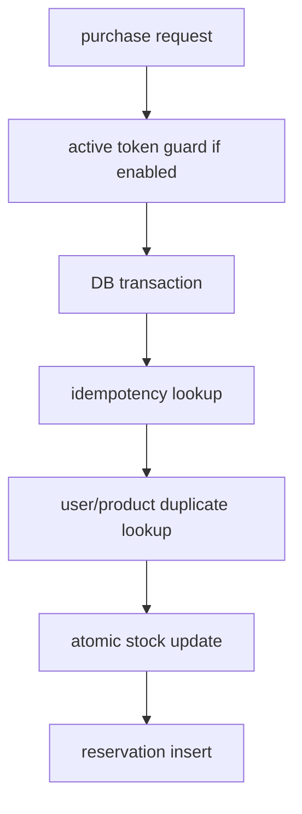
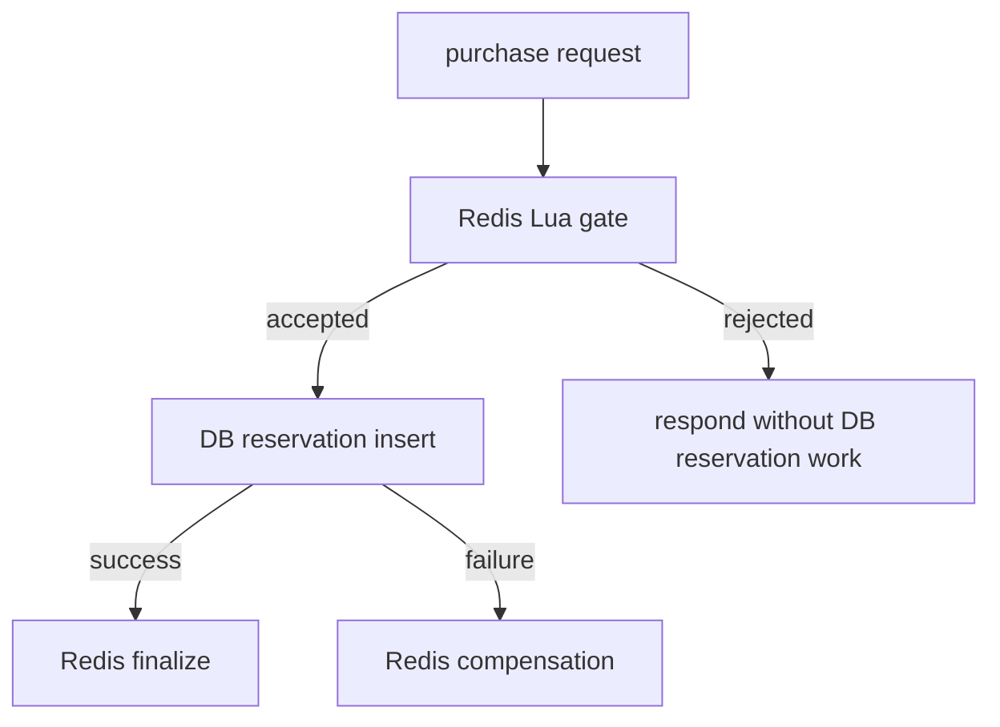

# v3.2 Front Gate Comparison Summary

## Purpose

v3.2 answers this question:

```text
After the waiting room controls entry traffic, is a simple RDB atomic reservation flow enough?
Or does Redis still deserve to sit in front of the DB as a front gate?
```

The important shift is that v3.2 is not just a stock-deduction strategy comparison. It compares two purchase architectures.

In v2, the comparison unit was small:

```text
PurchaseService
-> StockDeductionStrategy.deduct(productId)
```

In v3.2, the purchase decision needs more context:

```text
userId
productId
idempotencyKey
active token
existing reservation
stock
reservation persistence result
```

So forcing Redis front gate into `StockDeductionStrategy` would hide the real design problem. The comparison unit became `PurchaseFlow`.

## Terms In Plain Language

### Reservation

A reservation is a durable DB record that says:

```text
this user secured this product
```

In v3.2, PostgreSQL reservations are the durable business truth.

### Idempotency

Idempotency means a client can safely retry the same request without creating a second reservation.

Example:

```text
POST /purchases
X-IDEMPOTENCY-KEY: abc
```

If the first request created reservation #10, the retry with the same key should return reservation #10 again.

### Duplicate Reservation

A duplicate reservation means the same user tries to reserve the same product again with a different idempotency key.

Idempotency handles:

```text
same request repeated
```

Duplicate reservation protection handles:

```text
same user/product attempted again as a different request
```

### Front Gate

A front gate is a fast decision point before the DB transaction path.

It asks:

```text
Should this request even reach PostgreSQL reservation work?
```

For a limited sale, many requests are expected to be rejected:

```text
already sold out
duplicate retry
same user/product already reserved
missing active token
```

If these requests reach the DB transaction path, they still consume DB connections, indexes, locks, and CPU. Redis front gate tries to reject them earlier.

## Why v2 Redis Lua Was Not Enough

The v2 Redis Lua strategy made one narrow decision:

```text
Can stock be decremented?
```

That was useful for comparing stock consistency strategies, but it was not enough for v3.2.

v3.2 needs to answer:

```text
Is this idempotency key already completed?
Is another request with this key still processing?
Has this user already reserved this product?
Is there stock left?
If DB save fails after Redis accepted the request, how do we compensate?
```

This means Redis cannot be just a stock counter. If Redis is used, it needs to act as a reservation front gate.

## Architecture Candidates

### RDB Atomic

RDB atomic keeps the DB as the central decision point.



Strengths:

```text
simple mental model
PostgreSQL is the clear source of truth
no Redis marker lifecycle to explain
no Redis-DB finalize/compensation path in the normal model
```

Costs:

```text
sold-out requests still reach DB work
duplicate retries still reach DB work
tail latency depends heavily on DB connection pool and transaction pressure
```

### Redis Front Gate

Redis front gate decides before DB reservation work.



Strengths:

```text
rejects sold-out traffic before DB reservation work
rejects completed or in-flight idempotency retries before DB reservation work
can reduce DB pressure and tail latency under burst traffic
```

Costs:

```text
Redis markers must be designed and expired
DB save failure requires compensation
crash consistency is not fully solved by synchronous compensation
more states must be observed and explained
```

## Minimal Redis Front Gate Design

The v3.2 implementation is intentionally minimal. It is enough to compare the architecture, but it is not a full production recovery system.

The front gate uses Redis keys like:

```text
stock:available:{productId}
reservation:idem:{idempotencyKey}
reservation:user:{productId}:{userId}
```

The key states are:

```text
PROCESSING
RESERVED
```

### PROCESSING

`PROCESSING` means:

```text
Redis accepted the request, but DB reservation save is not finalized yet.
```

This prevents another identical request from decrementing stock again while the first request is still in flight.

### RESERVED

`RESERVED` means:

```text
DB reservation save succeeded and Redis marker was finalized.
```

Later retries with the same idempotency key can be treated as already completed.

## Redis Front Gate Flow

```text
1. Validate request fields.
2. Run Redis Lua gate.
3. Gate rejects immediately when:
   - idempotency marker is RESERVED
   - idempotency marker is PROCESSING
   - user/product marker already exists
   - stock is sold out
   - active token is missing when waiting room is enabled
4. Gate accepts by:
   - decrementing Redis stock
   - writing PROCESSING markers
5. Save reservation in PostgreSQL.
6. If DB save succeeds:
   - finalize Redis markers as RESERVED
7. If DB save fails:
   - compensate Redis stock
   - remove or restore PROCESSING markers
   - restore active token when needed
```

The important safety rule:

```text
Only compensate Redis after Redis accepted the request and DB persistence failed.
```

If Redis rejected the request, there is nothing to compensate.

## Why No Observer Or Reconciliation Worker Yet

A production-grade Redis front gate should eventually answer this failure:

```text
Redis gate accepted
-> process crashed before DB save
```

In that case, synchronous compensation cannot run because the application process is gone.

Possible production answers:

```text
PROCESSING marker TTL
periodic reconciliation between Redis markers and DB reservations
Redis Stream or durable pending log
outbox/inbox pattern
DB-truth recovery job
manual operations dashboard
```

v3.2 does not implement those on purpose.

Reason:

```text
The v3.2 experiment asks whether a Redis front gate has enough benefit to justify its extra complexity.
Adding observer/reconciliation/outbox now would add more variables and make the architecture comparison harder to explain.
```

So the project position is:

```text
Known limitation, intentionally deferred.
Synchronous compensation covers handled DB save failures.
Crash recovery is future production hardening.
```

This is a stronger portfolio answer than pretending the minimal implementation is fully production complete.

## Memory And TTL Thinking

Redis front gate stores more state than a stock counter.

Potential marker count grows with:

```text
number of accepted reservations
number of idempotency keys remembered
number of user/product guards
number of in-flight PROCESSING requests
```

Memory concerns:

```text
PROCESSING markers must not live forever.
RESERVED/idempotency markers need a retention policy.
User/product markers may be kept while the reservation is active.
High-cardinality idempotency keys can grow quickly under retries.
```

The minimal implementation uses short-lived PROCESSING semantics for in-flight safety and keeps the production-grade retention policy as future work.

Interview framing:

```text
Redis front gate buys DB protection by storing short-term control state.
That state has memory and lifecycle cost, so TTL and cleanup policy are part of the architecture, not an afterthought.
```

## Experiment Controls

The experiment tried to isolate architecture, not environment noise.

Fixed variables:

```text
same branch and codebase
same Docker Compose environment
same k6 script shape
same productId = 1
same stock setup per scenario
same Hikari pool size for primary comparison
same result CSV schema
```

Changed variable:

```text
PURCHASE_ARCHITECTURE=redis-frontgate
PURCHASE_ARCHITECTURE=rdb-atomic
```

Waiting room was disabled in the primary matrix:

```text
WAITING_ROOM_ENABLED=false
```

Reason:

```text
The primary matrix isolates the reservation architecture.
If waiting-room active capacity were varied at the same time, the result would mix entry-control effects with reservation-path effects.
```

The DB connection pool was also separated:

```text
primary comparison: Hikari max pool size fixed at 10
follow-up pool sweep: rdb-atomic with pool 5, 10, 20, 40
```

This keeps the main question clean while still acknowledging that DB pool size affects RDB atomic performance.

## Load Scenarios

### normal

```text
stock = 100
users = 1000, 3000, 5000
```

Question:

```text
Can each architecture handle oversubscription without oversell?
```

### sold-out

```text
stock = 0
users = 1000, 3000, 5000
```

Question:

```text
How cheaply can each architecture reject traffic when the product is already sold out?
```

### duplicate

```text
stock = max(100, users)
each user sends the same idempotency key twice
```

Question:

```text
Can retries return the existing reservation without creating duplicates?
How much latency does each architecture pay for idempotency handling?
```

### failure

```text
failure injection after stock/front-gate decision but before reservation save
failure limit = 10
```

Question:

```text
Does the system compensate accepted-but-not-persisted attempts and keep Redis/DB aligned?
```

## Result Summary

Measured record:

```text
records/experiments/v3-2-architecture-load-comparison.md
```

Correctness gate:

```text
24 primary runs
http_req_failed_rate = 0
unexpected_responses = 0
oversell_count = 0
decision_reservation_gap = 0
compensation_failure_metric = 0
```

Latency:

```text
Redis front gate had lower p95/p99 latency in every primary scenario and load level.
p95 reduction range: about 43.5% to 69.5%
```

Pool sweep:

```text
rdb-atomic performance changed when Hikari max pool size changed.
pool 20 was best for normal 3000 VU in this run.
pool 40 regressed, so bigger pool was not automatically better.
Redis front gate still beat the best observed rdb-atomic pool result at 3000 VU.
```

## What This Proves

This proves:

```text
Both candidates can preserve correctness under the tested local Docker conditions.
Redis front gate can materially reduce tail latency when many requests are rejected.
DB pool size is a real variable for rdb-atomic and must be controlled or reported.
```

This does not prove:

```text
production capacity
million-user concurrency
crash-consistent Redis/DB recovery
best possible PostgreSQL tuning
arrival-rate burst behavior
waiting-room active-capacity behavior
```

## Portfolio Narrative

A concise portfolio explanation:

```text
In v2, Redis Lua looked attractive as a fast stock counter.
In v3.2, after adding reservation truth and idempotency, I found that stock-only Redis was not the right comparison unit.
The real decision was whether Redis should be a DB front gate or whether PostgreSQL atomic updates were sufficient after entry control.

I implemented both paths in one codebase behind a purchase architecture selector.
Then I compared them under the same Docker Compose and k6 harness.
Both paths preserved correctness, but Redis front gate consistently reduced p95/p99 latency by rejecting sold-out and duplicate traffic before DB reservation work.

I also separated DB connection pool size as a follow-up variable, because otherwise rdb-atomic results could be unfairly blamed on architecture alone.
The pool sweep confirmed that RDB performance is pool-sensitive, but the front gate still showed a strong benefit in this local experiment.
```

## Interview Prompts To Be Ready For

### Why not just keep RDB atomic?

Answer direction:

```text
RDB atomic is the simpler and safer baseline, and it preserved correctness.
The front gate is justified only when rejected traffic is large enough that DB protection and tail-latency gains matter.
In this experiment, sold-out and duplicate traffic showed that benefit clearly.
```

### Is Redis the source of truth?

Answer direction:

```text
No. PostgreSQL reservation rows are the durable business truth.
Redis is used as a short-term admission and idempotency gate.
```

### What happens if DB save fails?

Answer direction:

```text
If Redis accepted the request and DB save fails inside the handled application flow, compensation restores Redis stock and markers.
The failure scenario injected this case and recorded compensation success with gap = 0.
```

### What happens if the process crashes after Redis accepts?

Answer direction:

```text
The minimal v3.2 implementation does not fully solve crash consistency.
That is a known limitation.
Production hardening would need TTL-based cleanup, reconciliation, outbox/inbox, or a durable pending log.
```

### Why disable the waiting room in the primary load test?

Answer direction:

```text
To isolate the reservation architecture.
Waiting-room active capacity is another variable and should be swept separately.
```

### Why test DB pool size?

Answer direction:

```text
Because rdb-atomic depends more directly on DB connection availability.
If pool size were not controlled, the comparison could accidentally measure pool starvation instead of architecture.
So the main comparison fixed the pool and a separate sweep measured sensitivity.
```

## Follow-up Work

Recommended next experiments:

```text
1. Repeat primary matrix for confidence intervals.
2. Re-enable waiting room and sweep activeCapacity.
3. Add arrival-rate burst scenario for open-time traffic.
4. Add DB-reaching work counters for stronger DB-protection attribution.
5. Design crash recovery for Redis PROCESSING markers before calling this production-ready.
```
