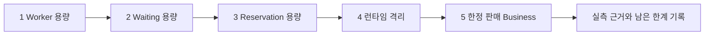
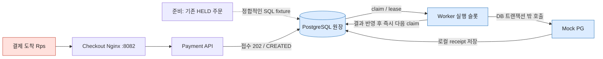
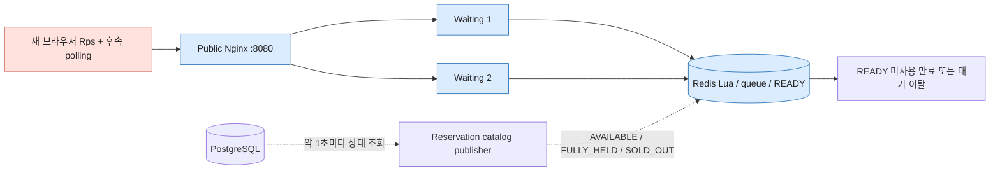
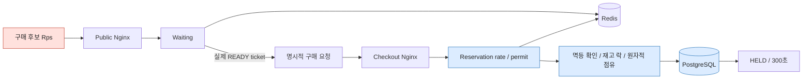
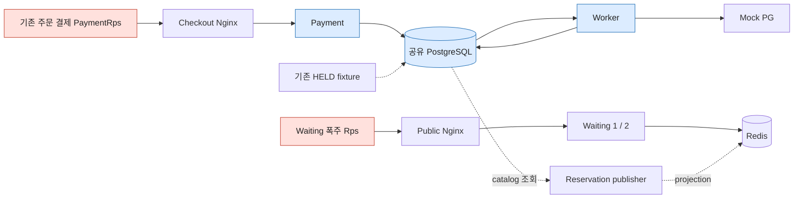
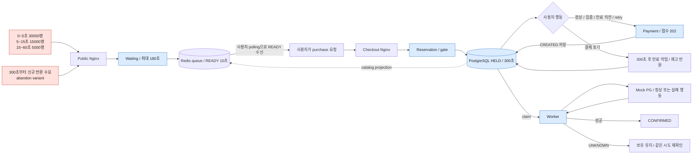
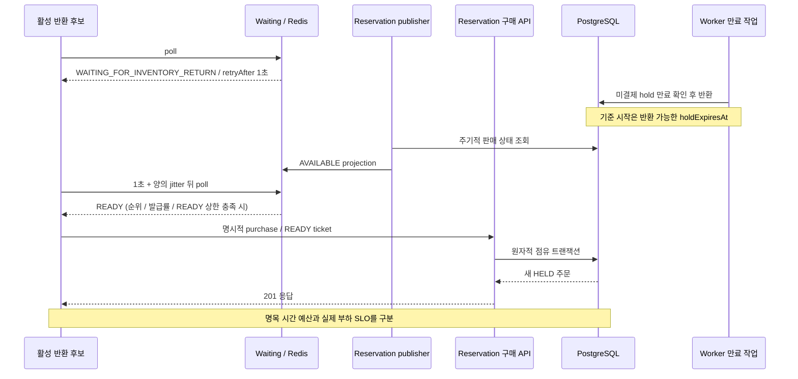

# Target v1 — 아키텍처 위에서 보는 부하 시나리오

**현재 위치: 기능 구현·계약 검증 완료 → 단계별 성능 시험 준비. 아래 그림은 시험 설계이며 측정 결과가 아니다.**
명령·수집 파일·판정 기준은 [Target 실행 가이드](target-v1-load-guide.md), 역할 계약은 [Target v1](target-v1.md)을 따른다.
빨간 노드는 그 시험의 부하 발생원, 파란 노드는 주요 관측 대상이다. 점선은 fixture/주기 작업이다.
모든 역할은 같은 호스트를 사용하며 PostgreSQL·CPU·메모리·네트워크를 공유한다.

## 1. Worker — 구매 유입과 분리한 결제 처리 용량

**질문:** 16 jobs/s의 구조적 상한 제거 후 어느 자원이 먼저 막히는가?
성공 확정/s, active slots, PG/job 시간, backlog 기울기·최고 나이, Hikari·DB·Mock PG CPU를 연결해 본다.
정상 최소 요구 약32/s와 검증 목표40/s를 구분한다. Payment API가 목표 공급을 못 만들면 Worker 한계 판정은 보류한다.

## 2. Waiting — 대량 유입을 DB 밖에서 흡수하는 비용

**질문:** join/poll RPS가 증가할 때 Redis와 Waiting은 얼마나 저렴하게 처리하는가?
Waiting→DB 요청선은 없다. publisher와 관측 SQL의 고정 비용은 남는다.
429/503·p95/p99·Redis script 비용과 CPU, 대량 이탈 후 stale 정리 속도를 본다. READY 미사용으로 재고가 점유되면 실패다.

## 3. Reservation — 유효 READY에서 DB 임계 구간까지

**질문:** READY 발급률과 실제 구매 진입률은 어떻게 다르고, 정상 READY가 gate에서 얼마나 거절되는가?
READY→purchase→성공 처리율을 나란히 놓고 lock/Hikari와 지연을 본다.
Waiting은 유입 조절, Reservation rate/permit은 DB 보호다. 발급률이 먼저 제한되면 DB 용량을 측정했다고 말하지 않는다.

## 4. Isolation — Waiting 폭주 중 이미 잡은 주문의 결제

**질문:** 같은 결제 공급률에서 Waiting 폭주를 더해도 결제 접수 p95≤1초와 작업 진행이 유지되는가?
HTTP pool/DB pool/quota는 분리되어도 물리 자원은 공유된다. Worker 시험과 같은 조건으로 비교한다.
이 시험은 실행 중 격리의 증거이며, Reservation 장애 중 Payment 독립 기동의 증거는 아니다.

## 5. Business — 50,000명 / 재고 1,000개의 전체 시간 흐름

정상은 60초 내 초기 점유·120초 내 950개 확정을 본다. 다른 variant는 해당 시간·실패 계약을 별도 판정한다.
FULLY_HELD는 SOLD_OUT이 아니다. 반환 대기는 1초+jitter로 조회하며, 180초가 지난 원래 사용자를 서버가 자동 구매시키지 않는다.
반환 이후 재구매와 5초 목표는 실제 재고 상태·만료 시각·새 주문 시각을 함께 확인한다.

실제 부하가 끝나면 이 그림을 성과로 바꾸는 대신, 실행 ID·입력·개별 결과·관측 한계를 별도 결과 기록에 연결한다.
